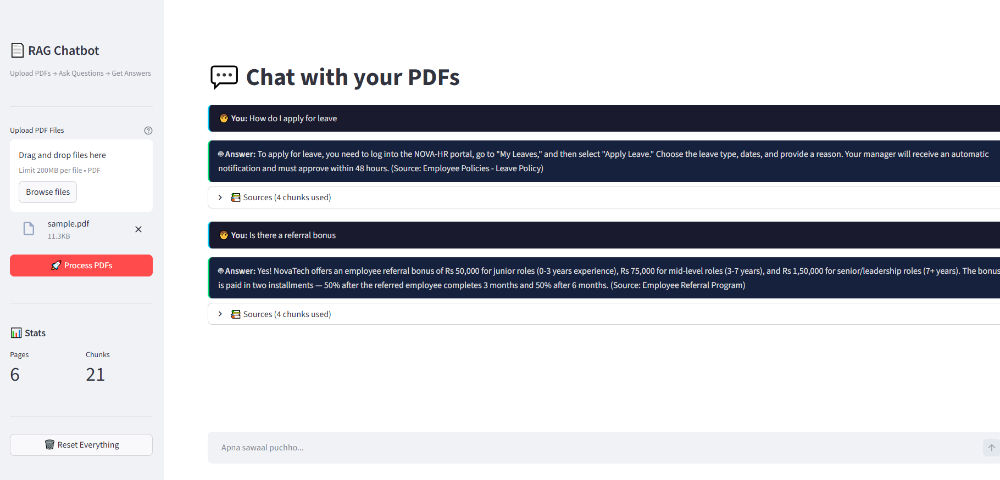

# 📄 RAG Chatbot — PDF Question Answering System

Upload any PDF → Ask questions in natural language → Get accurate answers with source citations.


---

## 📸 Demo



---

## 🎯 What It Does

A Retrieval-Augmented Generation (RAG) chatbot that reads your PDF documents and answers questions about them. Every answer comes with source citations showing exactly which page and chunk the information came from.

**Example:**
```
📄 Uploaded: company_handbook.pdf

🧑 Q: "What is the leave policy for employees?"
🤖 A: "All full-time employees are entitled to 24 days of Paid Leave,
       12 days of Sick Leave, 10 Public Holidays, and 5 days of Casual Leave
       per calendar year..."
📚 Source: Page 2, Chunk 3
```

---

## 🏗️ Architecture

```
┌──────────────┐     ┌──────────────────┐     ┌──────────────┐
│  PDF Upload  │────▶│  Text Extraction │────▶│   Chunking   │
│  (PyPDF)     │     │  (page by page)  │     │  (500 chars) │
└──────────────┘     └──────────────────┘     └──────┬───────┘
                                                      │
                                                      ▼
┌──────────────┐     ┌──────────────────┐     ┌──────────────┐
│   Answer     │◀────│   LLM (GPT-3.5) │◀────│  ChromaDB    │
│  + Sources   │     │ Context + Query  │     │  (Vectors)   │
└──────────────┘     └──────────────────┘     └──────┬───────┘
                                                      ▲
                                                      │
                                              ┌───────┴──────┐
                                              │  User Query  │
                                              │  (Embedding) │
                                              └──────────────┘
```

**RAG Pipeline Steps:**

1. **Load** — PDF pages extracted via PyPDFLoader
2. **Chunk** — Text split into 500-char overlapping chunks
3. **Embed** — Each chunk converted to vector embedding (OpenAI text-embedding-ada-002)
4. **Store** — Vectors indexed in ChromaDB for similarity search
5. **Retrieve** — User query embedded → top-4 similar chunks retrieved
6. **Generate** — Retrieved chunks + query + chat history → GPT-3.5-turbo → answer

---

## 🛠️ Tech Stack

| Component       | Technology                | Purpose                              |
|-----------------|---------------------------|--------------------------------------|
| Framework       | LangChain 1.2+            | RAG pipeline orchestration           |
| Vector Store    | ChromaDB                  | Embedding storage & similarity search|
| LLM             | OpenAI GPT-3.5-turbo      | Answer generation                    |
| Embeddings      | OpenAI text-embedding-ada-002 | Text → vector conversion         |
| PDF Parsing     | PyPDF                     | PDF text extraction                  |
| UI              | Streamlit                 | Chat interface                       |
| Chat Memory     | LangChain Messages        | Multi-turn conversation support      |

---

## 🚀 Quick Start

### 1. Clone the repo
```bash
git clone 
cd rag-chatbot
```

### 2. Create virtual environment
```bash
python -m venv venv

# Windows
venv\Scripts\activate.bat

# Mac/Linux
source venv/bin/activate
```

### 3. Install dependencies
```bash
pip install -r requirements.txt
```

### 4. Set up API key
```bash
cp .env.example .env
```
Open `.env` and add your OpenAI API key:
```
OPENAI_API_KEY=sk-your-api-key-here
```
Get your key at [platform.openai.com/api-keys](https://platform.openai.com/api-keys)

### 5. Run the app
```bash
streamlit run app.py
```
App opens at `http://localhost:8501`

### 6. Test (optional — CLI mode)
```bash
# Place any PDF in data/ folder first
python rag_engine.py
```

---

## 📁 Project Structure

```
rag-chatbot/
├── rag_engine.py       # Core RAG pipeline (load → chunk → embed → retrieve → generate)
├── app.py              # Streamlit chat interface
├── requirements.txt    # Python dependencies
├── .env.example        # API key template
├── .gitignore          # Git ignore rules
├── data/               # Sample PDFs for testing
│   └── sample.pdf      # NovaTech Company Handbook (test document)
├── screenshots/        # App screenshots
│   └── rag.png         # Demo screenshot
└── README.md
```

---

## ✨ Key Features

- **Multi-PDF Support** — Upload and query across multiple documents at once
- **Source Citations** — Every answer shows which page and chunk was used
- **Chat Memory** — Remembers conversation for follow-up questions
- **Chunk Overlap** — 50-char overlap prevents context loss at boundaries
- **Similarity Search** — Top-4 most relevant chunks retrieved per query
- **Reset Option** — Clear everything and start fresh with new documents

---

## ⚙️ Configuration

Tunable parameters in `rag_engine.py`:

| Parameter        | Default | What it controls                          |
|------------------|---------|-------------------------------------------|
| `chunk_size`     | 500     | Characters per chunk (smaller = precise)  |
| `chunk_overlap`  | 50      | Overlap between chunks                    |
| `k` (retriever)  | 4       | Number of chunks retrieved per query      |
| `temperature`    | 0       | LLM randomness (0 = deterministic)        |
| `model`          | gpt-3.5-turbo | OpenAI model used                   |

---

## 🔮 Future Improvements

- [ ] Support for DOCX, TXT, and web URLs
- [ ] Hybrid search (keyword + semantic)
- [ ] Re-ranking with cross-encoder
- [ ] Deploy on Hugging Face Spaces
- [ ] Evaluation metrics (retrieval accuracy, answer faithfulness)
- [ ] Upgrade to Agentic RAG with LangGraph

---

## 📝 What I Learned

- How text embeddings capture semantic meaning and enable similarity search
- The importance of chunk size and overlap in retrieval quality
- How chat history enables multi-turn conversations in RAG systems
- Trade-offs between retrieval precision vs recall when tuning `k` parameter
- Why source attribution matters for trustworthy AI applications

---

## 📄 License

MIT
